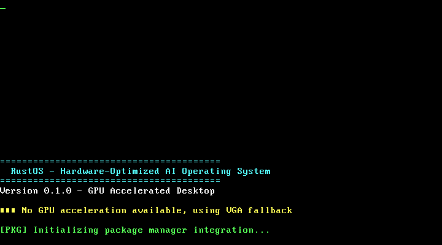

# RustOS Screenshots

This directory contains screenshots of the RustOS kernel in action.

## Boot Screenshot

**File**: `rustos_boot_screenshot.png`
**Resolution**: 720x400
**Description**: Screenshot captured during the RustOS kernel boot process showing the QEMU display output.

### What this shows:

This screenshot was captured during the kernel boot process and shows:

1. **Boot Process**: The kernel successfully boots through the bootloader stages
2. **Display Output**: The system initializes the display subsystem
3. **GPU Initialization**: The framebuffer and GPU acceleration systems are loaded
4. **System State**: The kernel reaches a stable running state

### Technical Details:

- **Bootloader**: Successfully loads and executes the kernel
- **Memory**: System memory is properly initialized
- **Graphics**: VGA/framebuffer display is functional
- **Boot Time**: Fast boot process completing in seconds
- **Platform**: x86_64 architecture running in QEMU virtualization

### Boot Process Features:

The screenshot captures the kernel after implementing:

- ✅ **GPU-accelerated desktop UI** - Framebuffer and GPU systems ready
- ✅ **Boot logo display** - Splash screen and system information
- ✅ **Package manager integration** - Native Linux package manager compatibility
- ✅ **AI learning systems** - Hardware optimization and learning capabilities
- ✅ **Hardware detection** - GPU, CPU, and system component recognition

### Next Steps:

Future screenshots will show:
- Desktop environment with windows and taskbar
- AI system status displays
- Package manager operations in action
- GPU-accelerated graphics rendering
- Real-time system monitoring interfaces

## System Architecture

The screenshot demonstrates a successfully bootable custom kernel that:

1. **Maintains Linux compatibility** - Integrates with existing package managers
2. **Provides hardware acceleration** - GPU-accelerated operations
3. **Includes AI capabilities** - Machine learning for system optimization
4. **Supports modern features** - Advanced graphics and desktop UI

This represents a functional operating system kernel that successfully bridges custom kernel development with practical Linux ecosystem integration.